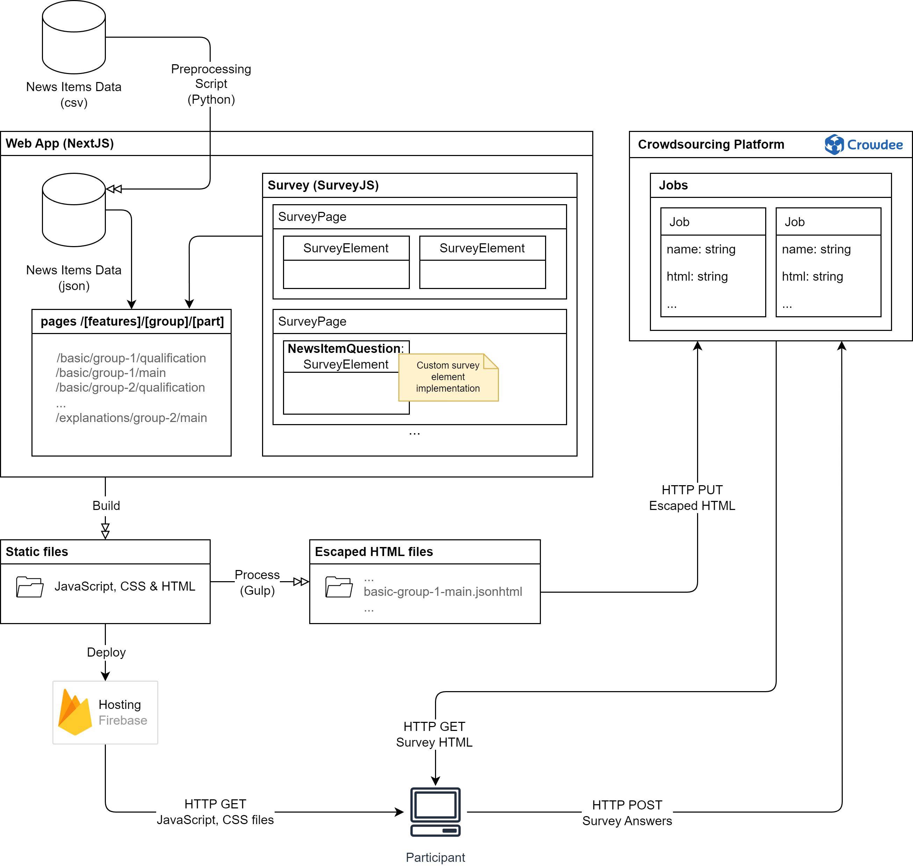

# Evaluation of Explainability Features in the Fake News Detection Context

This repository contains the implementation of a web application for the Master's Thesis "Evaluation of Explainability Features in the Fake News Detection Context", along with scripts for the data processing and analysis.

## Web App implementation

### Built With

- [Next.js](https://nextjs.org/docs)
- [React](https://react.dev/learn)
- [SurveyJS](https://surveyjs.io/documentation)
- [Material UI](https://mui.com/material-ui/getting-started/overview/)

## Data cleaning and analysis

See the [Data_Cleaning_XAI.ipynb](./data-analysis/Data_Cleaning_XAI.ipynb) notebook for data cleaning and the [Data_Analysis_XAI.ipynb](./data-analysis/Data_Analysis_XAI.ipynb) notebook for data analysis.

Raw survey data is available in the [data-analysis/data/raw](./data-analysis/data/raw) folder and news items can be found in the [news-items.csv](./preprocessing/news-items.csv) file.
