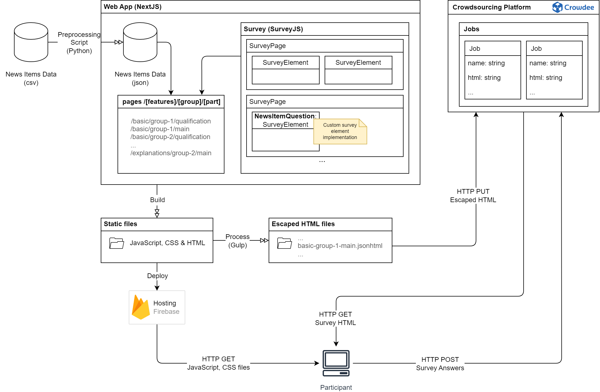

# Evaluation of Explainability Features in the Fake News Detection Context

This repository contains the implementation of a web app for the experimental part of the Master Thesis "Evaluation of Explainability Features in the Fake News Detection Context", along with scripts for the data processing and analysis.

## Web App implementation

### Built With

- [Next.js](https://nextjs.org/docs)
- [React](https://react.dev/learn)
- [SurveyJS](https://surveyjs.io/documentation)
- [Material UI](https://mui.com/material-ui/getting-started/overview/)
